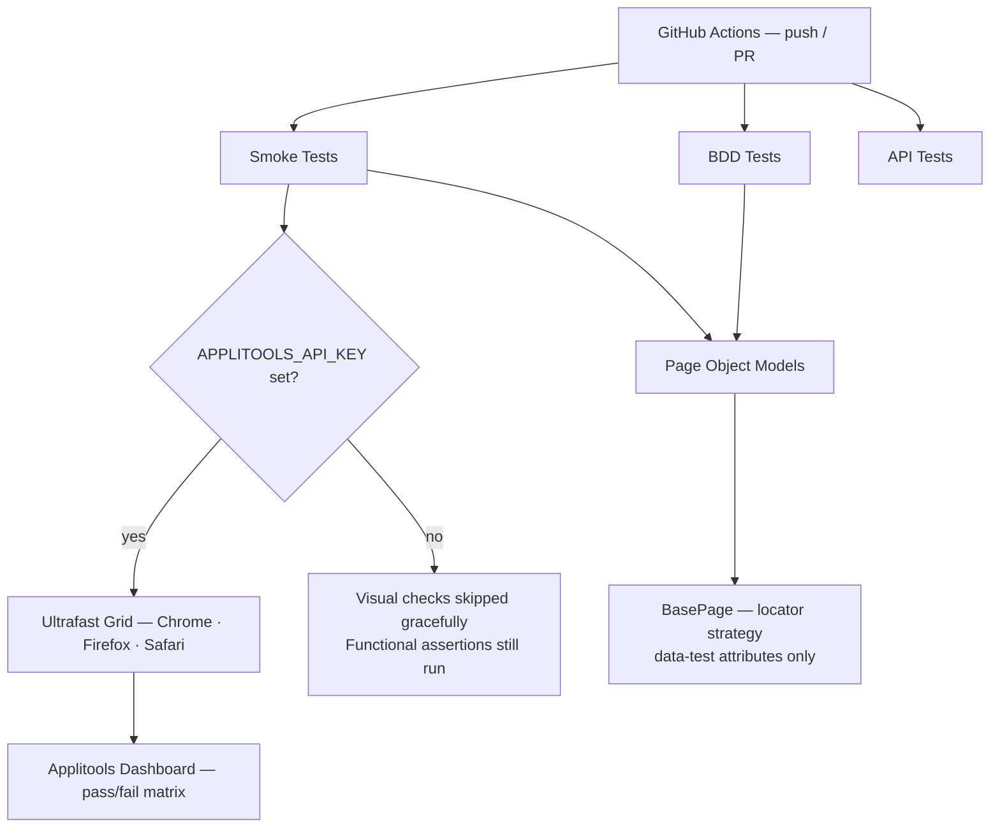
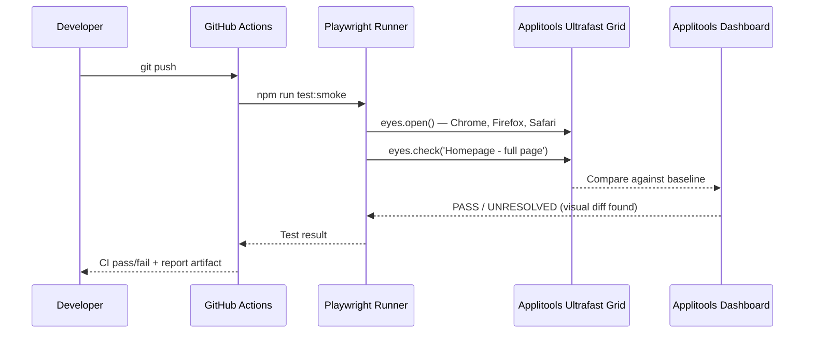

# QA AI Automation Framework


As a SDET I own the full quality strategy for my team — which means I also decide which tools are worth the investment and which ones are hype. I built this framework to answer that question practically: does adding visual AI to a Playwright suite actually catch things that traditional assertions miss? The answer is yes, and this repo shows exactly where and why.

Built against [practicesoftwaretesting.com](https://practicesoftwaretesting.com) — a realistic demo store with auth, cart, and product APIs that gave me enough surface area to test all three layers properly.

---

## What this covers

Five smoke tests cover the core purchase journey from homepage through checkout, each with a visual checkpoint that catches layout regressions across Chrome, Firefox, and mobile Safari in a single Ultrafast Grid run. I added a separate API test layer because the UI tests were too slow to verify every auth and cart edge case — field-level contract failures need fast feedback, not a full browser boot.

BDD scenarios sit on top of the same Page Objects, so non-technical stakeholders on my team can read the test intent without needing to parse TypeScript.

---

## Architecture



---

## Sequence: how a visual regression gets caught



---

## Test coverage

### Smoke tests — `tests/smoke/smoke.test.ts`

Five tests covering the full purchase journey, each with at least one visual checkpoint:

- **SMOKE-01** Homepage loads — product grid, title, visual baseline
- **SMOKE-02** Login with valid credentials — this one caught a real issue: the post-login redirect had an inconsistent layout shift on mobile Safari that `expect(url).toBe(...)` passed straight through. The visual checkpoint flagged it.
- **SMOKE-03** Search returns results — result count, first title match, visual snapshot
- **SMOKE-04** Product detail + add to cart — name/price visible, item added, snapshot before and after
- **SMOKE-05** Cart summary — item count, total displayed, checkout button, visual snapshot

### API tests — `tests/APITests/`

Separate from the UI layer deliberately — these run in under 10 seconds and give faster feedback on contract-level failures:

- `auth.api.test.ts` — `POST /auth/login`: 200 + JWT returned, malformed token rejected, bad credentials return 4xx
- `products.api.test.ts` — pagination, search, related products
- `brands.api.test.ts` — list, by ID, search
- `categories.api.test.ts` — tree structure, category search
- `cart.api.test.ts` — create cart, add item, update quantity, delete

### BDD scenarios — `features/`

Five feature files covering the same journeys as the smoke tests. The value here is that the Gherkin scenarios go into the sprint review deck — the team can verify acceptance criteria without reading TypeScript.

```gherkin
# features/smoke03-search.feature
Scenario: Search returns relevant results for a known term
  Given I navigate to the homepage
  When I search for "Pliers"
  Then the search results should contain at least one product
  And the first product title should contain "Pliers"
```

---

## Key design decisions

### Page Object Model — `pages/`

Every page extends `BasePage`. All locators use `data-test` attributes — no CSS classes, no XPath. This was a deliberate call: `data-test` attributes are stable across styling refactors and Copilot learns the convention from the instructions file.

```typescript
// pages/HomePage.ts
export class HomePage extends BasePage {
  readonly searchInput = this.page.locator('[data-test="search-query"]');
  readonly productCards = this.page.locator('a[href^="/product/"]');

  async searchFor(term: string) {
    await this.searchInput.fill(term);
    await this.searchButton.click();
  }
}
```

### Visual AI — Applitools Eyes with Ultrafast Grid

Each smoke test opens an Eyes session, takes targeted checkpoints, and closes. The Ultrafast Grid fans out to Chrome, Firefox, and mobile Safari in a single test run — no extra CI time cost versus running Chrome alone.

```typescript
if (VISUAL_ENABLED) {
  await eyes.open(page, 'PracticeSoftwareTesting', 'SMOKE-01: Homepage');
  await eyes.check('Homepage - full page', Target.window().fully());
  await eyes.close();
}
```

Visual checks skip gracefully when `APPLITOOLS_API_KEY` is absent, so the functional assertions run in every environment including local without any setup.

### GitHub Copilot integration — `.github/copilot-instructions.md`

Copilot's first generated locators used CSS classes (`page.locator('.search-input')`) instead of `data-test` attributes. After I added the instructions file describing the project's locator strategy, test ID format, Eyes session lifecycle, and BDD imports, the generated code matched the codebase conventions without manual cleanup. That file took 20 minutes to write and now saves correction time on every generated suggestion.

### Why Applitools over Percy

Percy runs each browser as a separate CI job. Applitools Ultrafast Grid sends the DOM snapshot to Applitools' cloud and renders across browsers server-side — one test execution, three browser results. For a team running on a shared CI quota, that matters.

### What I evaluated but didn't keep — Mabl and Testim

During the AI tools evaluation phase I ran both Mabl and Testim against this demo store. Testim's auto-generated selectors were brittle on the dynamic product IDs — it kept generating attribute-based selectors that broke on re-render. Mabl handled flaky selectors better through its self-healing model, but requires a cloud-hosted runner per project, which isn't practical for a shared team repo without budget approval.

The conclusion: for a framework I own and can set conventions on, Playwright's built-in retry logic combined with stable `data-test` locators and Applitools layout matching covers the same ground without the external dependency. For a legacy codebase where you can't control locator quality, Mabl's self-healing is worth it.

---

## Quick start

### 1. Clone and install

```bash
git clone https://github.com/rashmieravichandran06121989/qa-ai-automation-framework.git
cd qa-ai-automation-framework
npm install
```

### 2. Install Playwright browsers

```bash
npx playwright install --with-deps chromium
```

### 3. Configure Applitools (optional)

```bash
cp .env.example .env
# Edit .env and add your free API key from https://applitools.com
# If you skip this step, visual checks are skipped and functional tests run normally
```

> First run tip: if you see `Eyes session failed to open`, check that `APPLITOOLS_API_KEY` is set correctly. The error is silent in some environments — the test passes but no visual check runs.

### 4. Run the tests

```bash
# Smoke tests — UI + visual
npm run test:smoke

# BDD scenarios
npm run test:bdd

# API tests (fastest — no browser)
npm run test:api

# Open the HTML report
npm run test:report
```

### Environment variables

| Variable | Required | Description |
|---|---|---|
| `APPLITOOLS_API_KEY` | Optional | Enables visual AI checkpoints. Get a free key at [applitools.com](https://applitools.com) |

---

## CI setup

The GitHub Actions workflow (`.github/workflows/playwright.yml`) runs on every push and pull request:

1. Installs Node 20 + dependencies
2. Installs Chromium via `playwright install`
3. Runs smoke, BDD, and API tests in sequence
4. Uploads the Playwright HTML report as a build artifact

Add `APPLITOOLS_API_KEY` as a repository secret to enable visual regression checks in CI. Without it the workflow still runs and passes — visual steps are skipped, not failed.

---

## Project structure

```
qa-ai-automation-framework/
├── .github/
│   ├── copilot-instructions.md   # Teaches Copilot the project's conventions
│   └── workflows/
│       └── playwright.yml        # CI pipeline
├── docs/
│   └── screenshots/              # CI output screenshots for README
├── features/                     # Gherkin feature files (BDD)
├── fixtures/                     # Shared test fixtures + BDD bindings
├── pages/                        # Page Object Models
│   ├── BasePage.ts
│   ├── CartPage.ts
│   ├── HomePage.ts
│   ├── LoginPage.ts
│   └── ProductPage.ts
├── steps/                        # BDD step definitions
├── tests/
│   ├── APITests/                 # REST API tests + ApiClient class
│   └── smoke/
│       └── smoke.test.ts         # 5 smoke tests with visual checkpoints
├── applitools.config.ts          # Applitools Eyes + Ultrafast Grid config
├── playwright.config.ts          # Playwright config
└── .env.example                  # Environment variable template
```

---

## Stack

- **[Playwright](https://playwright.dev)** — cross-browser end-to-end testing
- **[Applitools Eyes](https://applitools.com)** — visual AI regression testing via Ultrafast Grid
- **[playwright-bdd](https://vitalets.github.io/playwright-bdd)** — BDD/Gherkin for Playwright (same runner, shared fixtures, single report)
- **[TypeScript](https://www.typescriptlang.org)** — strict mode throughout
- **[GitHub Actions](https://github.com/features/actions)** — CI/CD
- **[GitHub Copilot](https://github.com/features/copilot)** — AI pair programming with project-specific instructions via `.github/copilot-instructions.md`
