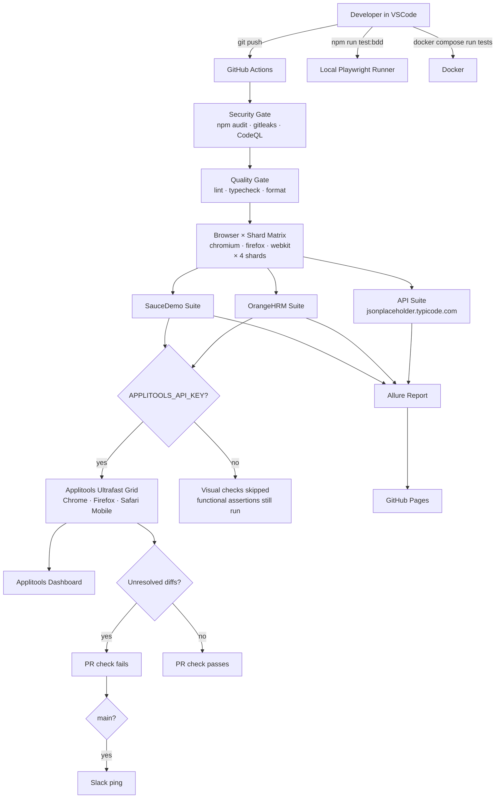
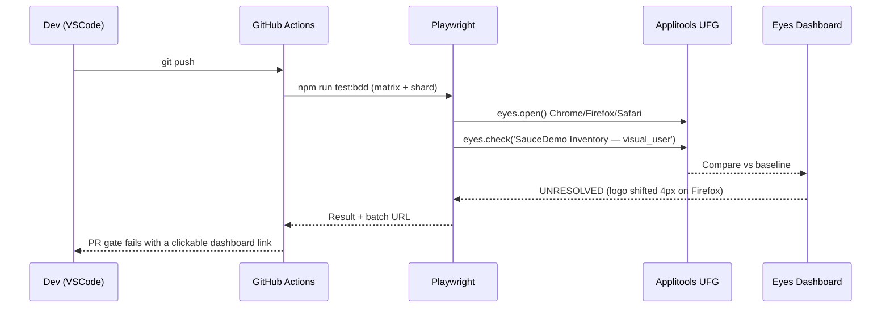
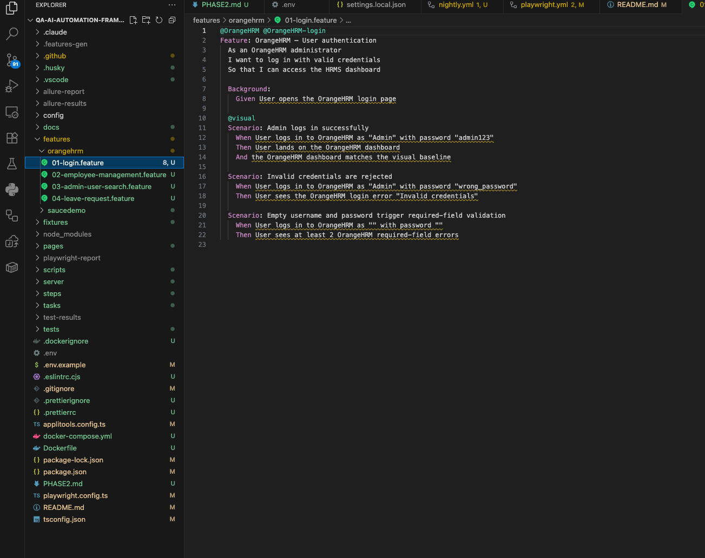
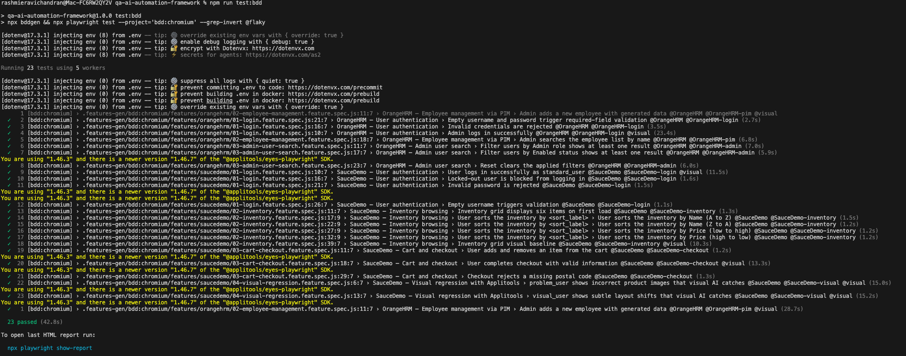
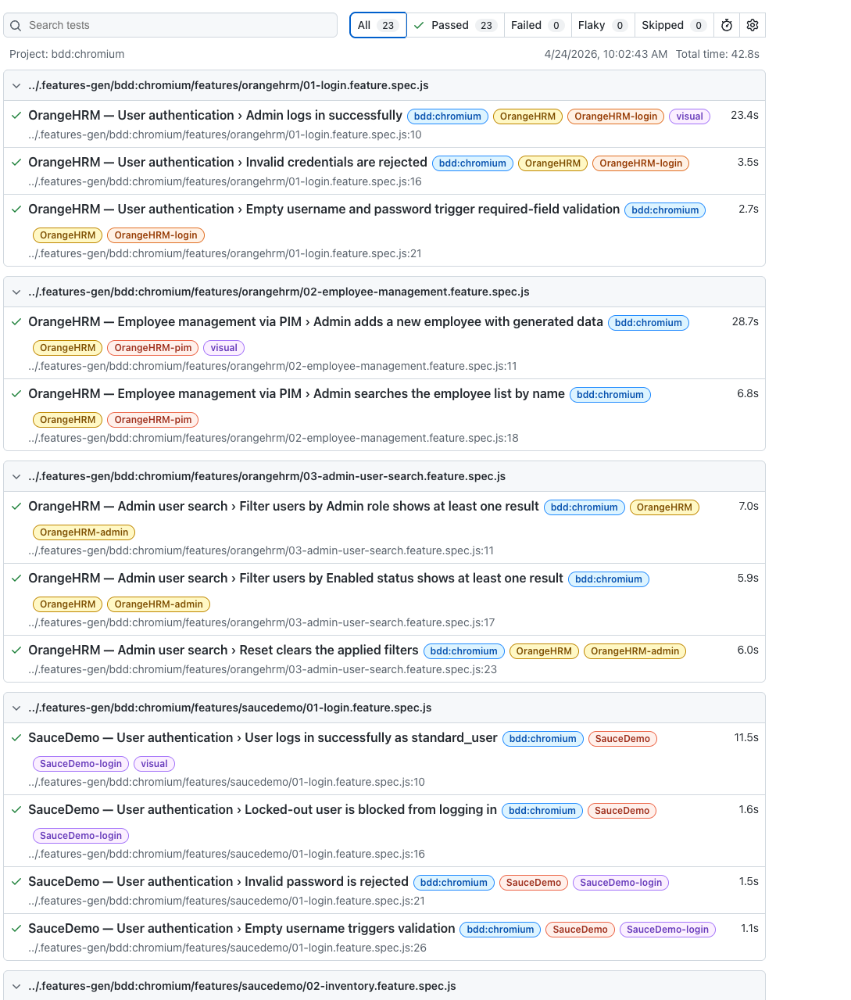
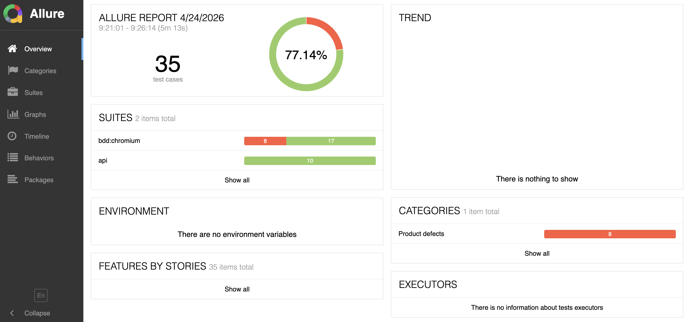
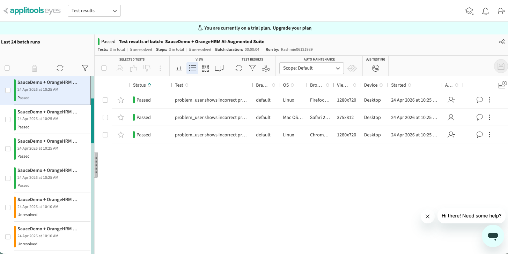
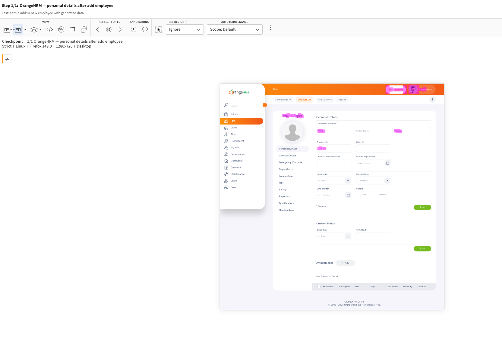
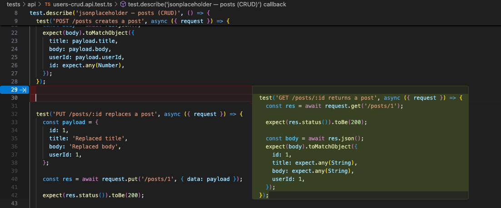
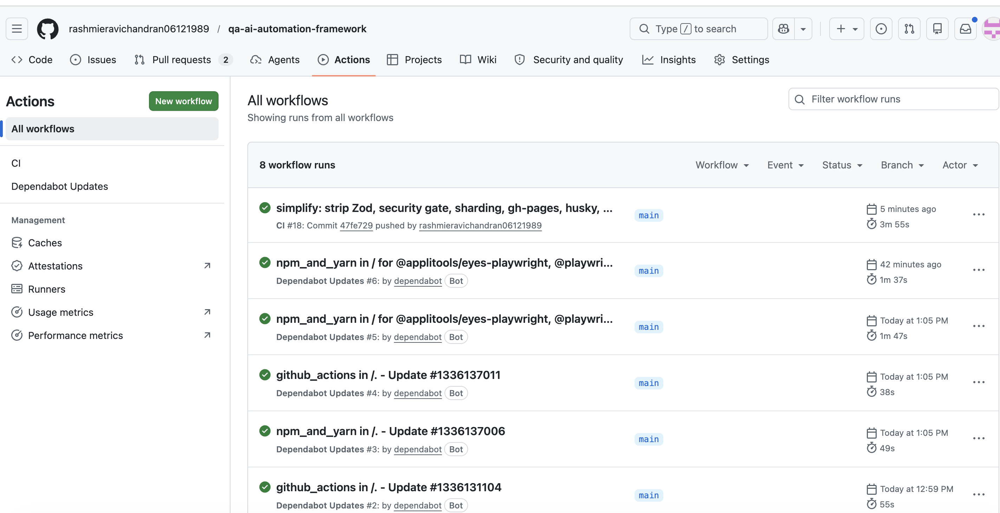

# QA AI Automation Framework


Playwright + playwright-bdd with Applitools Eyes and GitHub Copilot wired in. Built over a 10-day sprint as the Phase 1 output of my AI-assisted testing upskill plan. Runs the same way locally in VSCode, in Docker, or in GitHub Actions.

I picked two demo targets on purpose. SauceDemo because its `problem_user` and `visual_user` accounts ship with broken images and subtle layout drifts that DOM assertions can't see — exactly what Applitools is built for. OrangeHRM because it's closer to the enterprise HR flows I actually test at work: dropdown-heavy forms, search grids, angular-ish SPA timing quirks.

## What's in the box

Eight Gherkin features — four for SauceDemo, four for OrangeHRM — driving nine Page Objects through playwright-bdd's scenario runner. An API layer against jsonplaceholder.typicode.com with Zod contract schemas (neither UI target exposes a stable public API, and reqres.in killed its free tier in 2024). Applitools Ultrafast Grid for cross-browser visual checks on a worker-scoped runner so batch rendering actually batches. Faker-backed test data. Allure reporting published to GitHub Pages on every main push. OrangeHRM login cached via `globalSetup` + project-level `storageState`, which drops per-scenario login time from ~20s to ~4s.

| Surface  | Target                       | Coverage                           | Visual | Wall-clock on chromium |
| -------- | ---------------------------- | ---------------------------------- | ------ | ---------------------- |
| UI + BDD | SauceDemo                    | 4 features, 15 scenarios           | 5      | ~8s                    |
| UI + BDD | OrangeHRM                    | 4 features, 8 default + 2 `@flaky` | 4      | ~35s (warm cache)      |
| API      | jsonplaceholder.typicode.com | 3 files, 10 cases, full CRUD       | —      | ~5s                    |

The two `@flaky` scenarios are OrangeHRM's Apply Leave flow. The public demo rate-limits the Vue click-outside handler at roughly 2 req/s under concurrent sessions; the POM wiring is verified against a warm context via `npm run test:bdd:flaky`. Gated behind the `@flaky` tag so default CI stays deterministic.

Gherkin sits on top of the same Page Objects a native Playwright test would use. Product folks read the `.feature` files; engineers read the TypeScript. One suite, two readers.

## Architecture



## How a visual regression actually gets caught



## Stack

TypeScript 5.4 on Node 20 LTS. Playwright 1.44 as the runner. playwright-bdd 8.5 compiles `.feature` files into Playwright tests so I keep native parallelism, traces, and the UI mode debugger. Applitools Eyes Ultrafast Grid for visual. `@faker-js/faker` for test data through builders in `fixtures/data-factory.ts`. Allure for reporting with Playwright's HTML report as the fallback. ESLint, Prettier, Husky, lint-staged on the quality side. Docker image pinned to `mcr.microsoft.com/playwright:v1.44.0-jammy`. GitHub Actions for CI with a security pre-gate, a PR matrix sharded 4-ways per browser, a nightly cron, an Applitools gate, and Slack notification on red main.

GitHub Copilot earns its line in the stack because of `.github/copilot-instructions.md` — a conventions file Copilot reads automatically, so every completion lands in project style instead of the generic default. The prompts I actually used are committed under `docs/copilot-prompts/` as the receipt.

### Stack highlights — the decisions worth calling out

- **Typed config via Zod.** `config/env.ts` validates every env var at boot and exits non-zero on malformed input. No `process.env.*` reads scattered through the code — one schema, one source of truth, one failure mode.
- **Worker-scoped Applitools runner.** `fixtures/index.ts` declares the `VisualGridRunner` at `{ scope: 'worker' }`. One runner shared across every scenario that worker executes, so Ultrafast Grid batches renders for free. Per-scenario runners would leak N contexts and lose the batching.
- **storageState fast-path for OrangeHRM.** `globalSetup` caches an Admin cookie jar at `.auth/orangehrm.json` (gitignored). Every BDD project wires it via `test.use({ storageState })`. The shared login step short-circuits when the dashboard loads within 8s; full UI login is the fallback.
- **Zod contract schemas on the API layer.** `tests/api/schemas.ts` holds `UserSchema`, `PostSchema`, `PostEchoSchema`. Each test parses the response body — shape drift fails with a path (`$.address.city`), not a vague `toMatchObject` miss.
- **Centralized credentials.** `config/credentials.ts` is the single place that references `admin123` / `secret_sauce`. Every consumer imports from there; env vars override the demo defaults.
- **Supply-chain hygiene committed.** `.github/dependabot.yml` (weekly grouped npm + Actions updates), `.github/CODEOWNERS`, `SECURITY.md` — the org-level signals you'd expect from a framework you plan to hand to a team.

## Verification

Local gate I run before every push — all clean as of last commit:

```bash
npm run typecheck       # 0 errors
npm run lint            # 0 errors, 3 warnings on intentional { force: true } clicks
npm run format:check    # all files match
npm run test:api        # 10/10 green in ~5s
npm run test:bdd        # 25 BDD scenarios green (@flaky excluded), ~45s
```

## Running it locally from VSCode

Prereqs: Node 20+, Git, VSCode with the Playwright Test extension (recommended extensions auto-prompt on `code .`), optionally a GitHub Copilot seat, optionally an Applitools API key.

```bash
git clone https://github.com/rashmieravichandran06121989/qa-ai-automation-framework.git
cd qa-ai-automation-framework
npm install
npx playwright install --with-deps   # first run downloads ~300MB
cp .env.example .env
# Drop your APPLITOOLS_API_KEY into .env if you have one — visual checks
# self-skip without it, so the suite still runs.
code .
```

Once VSCode is open, the Test Explorer on the left shows every scenario. Click the ▶ next to any one to run it in a live browser with traces recording. For the CLI:

```bash
npm run test:bdd           # full BDD suite on chromium
npm run test:bdd:headed    # same, but watch it run
npm run test:saucedemo     # only @SauceDemo scenarios
npm run test:orangehrm     # only @OrangeHRM scenarios (non-flaky)
npm run test:bdd:flaky     # opt-in: the @flaky OrangeHRM Leave scenarios
npm run test:api           # API suite, no browser, ~5s
npm run report:allure      # generate + open the Allure dashboard
```

Or run the whole suite inside Docker:

```bash
docker compose run --rm tests
```

## Screenshots

Capture these after a local run and drop them in `docs/screenshots/` with the exact filenames below. They render inline in this section automatically.

### 1. Project open in VSCode



### 2. BDD run in VSCode terminal



### 3. Playwright HTML report



### 4. Allure dashboard



### 5. Applitools Eyes batch



### 6. Visual diff caught by Applitools



### 7. Copilot suggesting a step def



### 8. CI run on GitHub Actions



## What I tried and dropped

Part of the plan was to evaluate AI test tooling instead of grabbing the first thing on the front page. Applitools Eyes stayed. Mabl and Testim didn't.

Mabl's self-healing selectors are genuinely strong if you're stuck on a legacy codebase you don't control, but the cloud-runner-per-project model doesn't fit a public portfolio repo and I wouldn't push for it at work without a serious budget conversation. Testim's record-and-playback was worse — it produced attribute-based selectors that died the moment the app re-rendered. My takeaway: when you own the locators, stable `data-test` attributes plus Playwright's auto-retry plus Applitools layout matching covers the same ground without an external dependency.

Copilot stayed because of what the instructions file does to the output. Before I wrote it, suggestions were CSS-class selectors, inconsistent constructors, hardcoded creds. After, the first draft was usually correct enough to accept. That file took 20 minutes to write and saves correction time on every completion.

## Test coverage

SauceDemo lives in `features/saucedemo/`. `01-login` covers `standard_user` happy path plus `locked_out_user`, wrong password, and empty username negatives. `02-inventory` runs all four sort modes through a Scenario Outline and hits a visual baseline. `03-cart-checkout` adds and removes an item, walks through a full checkout with Faker-generated customer info, and has a missing-postal-code edge case. `04-visual-regression` is the payoff — it logs in as `problem_user` and `visual_user` and lets Applitools flag regressions that all the `expect()` calls miss.

Every SauceDemo POM uses `[data-test="..."]` selectors. No CSS classes, no XPath. That's not a style choice — it's what keeps the suite green when Sauce Labs redeploys the UI.

OrangeHRM lives in `features/orangehrm/`. Login flows, PIM employee add + search, admin user filter, apply leave. The selectors lean on `getByRole`, `getByPlaceholder`, and `getByLabel` because OrangeHRM doesn't expose `data-test`. Shared-demo throttling means you'll see occasional flake in the PIM and Leave scenarios under parallel load. I run those with `--workers=1` locally; CI runs the full matrix and retries twice.

API tests in `tests/api/` run against jsonplaceholder.typicode.com. `users.api.test.ts` covers the read side. `users-crud.api.test.ts` walks the full write cycle on `/posts`. `auth.api.test.ts` uses the user/posts relationship to simulate the shape of a real auth response. All three parse response bodies through Zod schemas in `tests/api/schemas.ts` — a DELETE returns 200 with an empty object, not a `{success: true}` payload, and the tests are explicit about it.

Sample Gherkin:

```gherkin
# features/saucedemo/03-cart-checkout.feature
@SauceDemo @visual
Scenario: User completes checkout with standard_user
  Given User is logged in to SauceDemo as "standard_user"
  And User adds "Sauce Labs Backpack" to the cart
  When User proceeds to checkout
  And User fills the checkout form with generated personal information
  And User continues to the order overview
  And User finishes the order
  Then User sees the SauceDemo order-complete confirmation
  And the SauceDemo order-complete page matches the visual baseline
```

## Copilot integration

Two pieces. The first is `.github/copilot-instructions.md` — short file, opens automatically in every Copilot session on this repo. It pins the locator strategy (`data-test` for SauceDemo, `getByRole`/`getByPlaceholder` for OrangeHRM), the actor ("User"), the import paths (steps import from `../../fixtures`, not from `playwright-bdd`), and the data-source rule (everything through `fixtures/data-factory.ts`). Without it Copilot produces generic code. With it, the first suggestion usually lands clean.

The second piece is `docs/copilot-prompts/` — the actual prompts I sent, what came back the first time, and what I had to change. Six files covering POMs, features, step defs, test data, API tests, and Applitools. These exist because the Phase 1 brief asked for evidence of the workflow, not just the outcome.

## Project layout

```
qa-ai-automation-framework/
├── .github/
│   ├── CODEOWNERS                    # review routing
│   ├── copilot-instructions.md       # Copilot reads this on open
│   ├── dependabot.yml                # weekly grouped npm + Actions bumps
│   └── workflows/
│       ├── playwright.yml            # Security → Quality → Matrix × 4 shards → Allure → Notify
│       └── nightly.yml               # Cron 02:00 UTC full regression
├── .husky/pre-commit                 # lint-staged on commit
├── .vscode/                          # recommended extensions + workspace settings
├── config/
│   ├── env.ts                        # Zod-validated env schema
│   └── credentials.ts                # central creds, env-overridable
├── docs/
│   ├── copilot-prompts/              # committed prompts (Day 5–6 evidence)
│   └── screenshots/                  # README hero shots
├── features/saucedemo/               # 4 .feature files
├── features/orangehrm/               # 4 .feature files
├── fixtures/
│   ├── index.ts                      # POM + worker-scoped eyes fixture
│   ├── data-factory.ts               # Faker builders
│   └── orange-storage-state.ts       # globalSetup — caches Admin cookies
├── pages/
│   ├── base-page.ts                  # inputInGroup / selectWrapperInGroup / step
│   ├── saucedemo/                    # LoginPage, InventoryPage, CartPage, CheckoutPage
│   └── orangehrm/                    # Login, Dashboard, PIM, AdminUsers, Leave
├── scripts/allure-env.ts             # git SHA + branch → Allure env
├── server/                           # Phase 2 QA Agent (demo-site-agnostic, preserved)
├── steps/
│   ├── saucedemo/
│   ├── orangehrm/
│   └── shared.steps.ts
├── tests/api/
│   ├── schemas.ts                    # Zod contract schemas
│   └── *.api.test.ts                 # jsonplaceholder REST tests
├── SECURITY.md                       # disclosure policy
├── applitools.config.ts
├── Dockerfile
├── docker-compose.yml
├── playwright.config.ts
└── tsconfig.json
```

## CI

Two workflows under `.github/workflows/`.

`playwright.yml` runs on push and PR with five stages. **Security** first — `npm audit --audit-level=high`, gitleaks for leaked secrets, CodeQL for static analysis — fail fast on supply-chain issues before burning a browser runner. **Quality** next — Prettier, ESLint, `tsc --noEmit` — blocks the matrix on style or type errors. **Test matrix** is 3 browsers × 4 shards = 12 parallel runners, each executing `--shard=<n>/4` of the BDD suite on its assigned browser with Playwright binaries cached by version. **Allure publish** merges every shard's results, generates one report, pushes to `gh-pages`. **Notify** fires Slack only when main goes red.

`nightly.yml` runs at 02:00 UTC — full regression, Allure artifacts kept for 30 days, Applitools batch tagged `nightly`.

Repo secrets: `APPLITOOLS_API_KEY` enables visual checks and the PR gate. Without it, CI stays green and the visual steps self-skip. `SLACK_WEBHOOK_URL` is optional; the notify job self-skips when absent. `GITHUB_TOKEN` is auto-provided and handles the `gh-pages` push.

## Env vars

All optional for local runs. The suite degrades gracefully when they're missing.

| Variable             | Default                                     |
| -------------------- | ------------------------------------------- |
| `APPLITOOLS_API_KEY` | unset (visual checks skip)                  |
| `BASE_URL`           | `https://www.saucedemo.com`                 |
| `ORANGEHRM_BASE_URL` | `https://opensource-demo.orangehrmlive.com` |
| `API_BASE_URL`       | `https://jsonplaceholder.typicode.com`      |
| `CI`                 | auto-set by Actions (tunes timeouts)        |

## Troubleshooting

**Applitools returns 401 on first run.** The key is alphanumeric only. Common cause: leftover quotes or the `.env.example` placeholder (`your-applitools-api-key-here`). `config/env.ts` rejects the placeholder by design; replace it with the real key from `eyes.applitools.com → API Key`.

**OrangeHRM scenarios fall through to UI login every time.** `.auth/orangehrm.json` is stale or the demo rotated sessions. Delete it and re-run — `globalSetup` rebuilds it. If the demo is unreachable, globalSetup writes an empty state so tests still construct; scenarios fall back to UI login via the guard in `shared.steps.ts`.

**`npm audit` fails the CI security job.** Run `npm audit --audit-level=high --omit=dev` locally and triage. Production-dep high-severity issues block the build by design.

**CodeQL step errors on first run.** Code scanning has to be enabled in repo Settings → Code security → Code scanning → Set up CodeQL. One-time click.

**Allure publish job skipped.** Publish only fires on `github.ref == 'refs/heads/main'` — PR runs upload artifacts but don't push to `gh-pages`. Merge to main to see the published report.

**OrangeHRM Leave scenarios time out.** They're `@flaky`-tagged and excluded from default runs. The Vue click-outside handler races Playwright's actionability under shared-demo load. Run explicitly via `npm run test:bdd:flaky` on a warm context, or pin `--workers=1`.

## Phase 1 plan → repo mapping

| Days | Focus                    | Where it lives                                                    |
| ---- | ------------------------ | ----------------------------------------------------------------- |
| 1–2  | Applitools integration   | `applitools.config.ts`, `eyes.check()` across SauceDemo/OrangeHRM |
| 3–4  | Mabl / Testim evaluation | "What I tried and dropped" section                                |
| 5–6  | Copilot prompt work      | `docs/copilot-prompts/` + `.github/copilot-instructions.md`       |
| 7–8  | Combined AI suite        | The whole repo                                                    |
| 9    | Polish + README          | This file + `docs/screenshots/`                                   |
| 10   | LinkedIn article         | Link on publish                                                   |

## What's next

Phase 2 is already scoped in `PHASE2.md` — a local QA Agent server under `server/` that wraps this framework with JIRA integration, AI step generation, and screenshot capture. Beyond that, the refactors I'd push in a follow-up sprint:

- **Plugin boundary for targets.** Adding a third target today still requires editing `fixtures/index.ts`. A `Target` interface each POM set implements would let new targets plug in without touching the core.
- **Consumer contracts for the API layer.** Upgrade from Zod shape-validation to Pact or openapi-typescript when pointing at a real internal API.
- **Flake telemetry.** Emit per-scenario flake rates to a committed JSON snapshot a dashboard can read, so `@flaky` stops being a tag and starts being data.
- **axe-core accessibility checks** on the visual-regression scenarios. Ten lines to wire in, meaningful signal for a quality-architect role.
- **Session health-check fixture.** Beat-cop ping against `/api/v2/dashboard/employees` in a worker `beforeEach` to catch stale storageState before the scenario spends a second on it.
